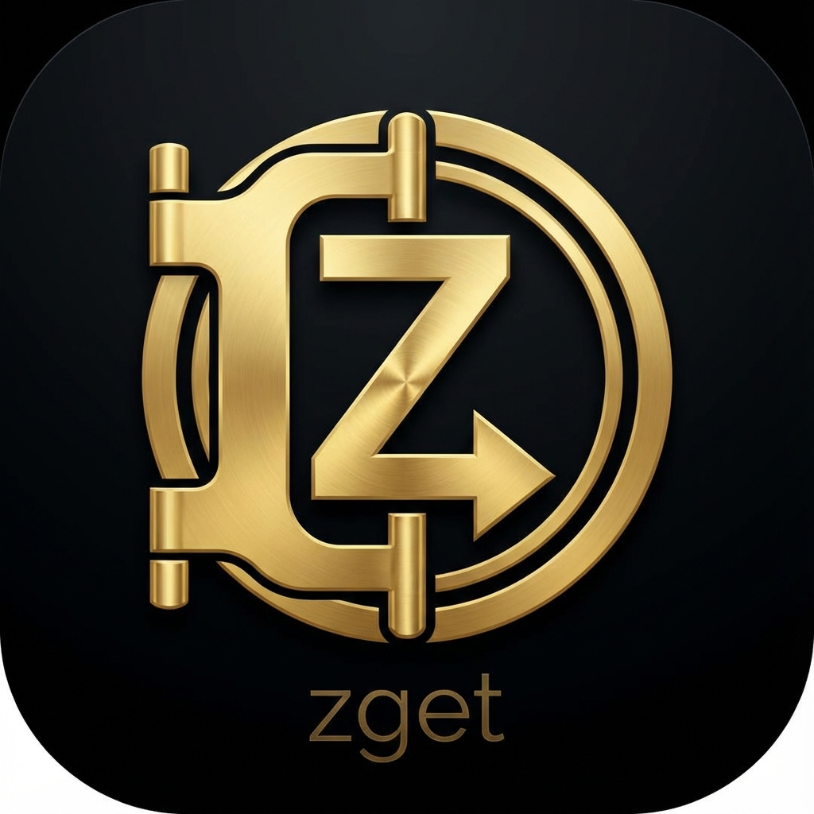

#  zget: The Archival Engine

`zget` is a high-fidelity media archival system built for personal high-fidelity preservation. It operates through a specialized triad: **The Archivist** (Ingestion), **The Vault** (Persistence), and **The Portal** (Discovery).

## The Triad

- **The Archivist (Server)**: A robust FastAPI engine that manages complex extraction and background downloads independently.
- **The Vault (Library)**: A persistent SQLite-backed repository (FTS5) designed for high-fidelity, metadata-rich media storage.
- **The Portal (PWA)**: A premium **Minimalist Portal** built with **Native Web Components**.
  - **Zero Build**: No bundlers, no npm, no transpilation. 100% native browser standards.
  - **Minimalist Aesthetics**: Zero-clutter mobile experience with a premium, app-native feel.
  - **Rich Player**: High-density technical metadata (Resolution, Codec, Views) with aggressive mobile download support.
  - **Natural Feed**: Dynamic aspect ratios for Vault cards—supporting landscape YouTube and vertical Reels natively.
  - **Regions & Registry**: Interactive explorer for 625+ verified sites, sorted by **Local Popularity**.
  - **Share Sheet Native**: Archive directly from mobile share sheets (iOS/Android).

## Acknowledgments

`zget` is made possible by the incredible work of the **yt-dlp** community and was refined with the assistance of the **Gemini** and **Antigravity** teams at Google DeepMind.

## Features

- **Site Intelligence**: Extensive site registry with automated smokescreen health monitoring.
- **Popularity-First Discovery**: Intelligent sorting that prioritizes your most-used platforms.
- **Archive-Grade Filenames**: Reliable file downloads on mobile with slugified, human-readable titles.
- **H.264 Standard**: Universal compatibility by prioritizing iOS-friendly codecs (automatic transcoding).
- **MCP Native**: First-class support for AI agents (e.g., Librarian) via the Model Context Protocol.

## Verified Platforms

Extensively tested and verified working:

| Platform | Status |
|----------|--------|
| YouTube | ✅ Verified |
| Instagram | ✅ Verified |
| X (Twitter) | ✅ Verified |
| TikTok | ✅ Verified |
| Reddit | ✅ Verified |
| Twitch | ✅ Verified |

## Architecture

```
src/zget/
├── server/         # The Portal (FastAPI & Native Web Components)
├── mcp/            # MCP server for agentic handoffs
├── core.py         # The Archivist (Archival Engine)
├── db/             # The Vault (SQLite FTS5)
├── health.py       # Smokescreen Verification Engine
└── cli.py          # Unified entry point & status
```

## Quick Start

### 1. Wake The Archivist

```bash
# Recommended: Use uv for high-speed execution
uv run zget-server --port 8000 --host 0.0.0.0
```

### 2. Enter The Portal

Access `http://localhost:8000` in any browser. Tap **"Add to Home Screen"** on iOS for the full experience.

## Roadmap

| Status | Feature | Description |
|--------|---------|-------------|
| 🔜 | **Subscription Feeds** | Auto-monitor channels/playlists for new archival. |
| 🔜 | **Watch Party Mode** | Sync playback across LAN devices. |
| 📋 | **iOS Shortcut Integration** | Deep linking via `zget://` URL scheme. |
| 📋 | **Transcript Extraction** | Subtitle archival using Whisper or native tracks. |
| 💡 | **Librarian Handoff v2** | Full multimodal indexing (frames, faces, voiceprints). |

## License

MIT
